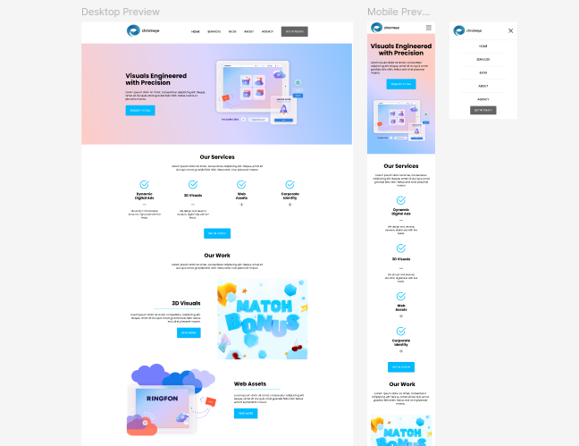

# 🚀 Interactive Landing Page | Figma to Code  

A responsive landing page built with **React**, based on a **Figma design**. 

## 🌐 **Live Demo**  
🔗 [View the project here](https://react-landing-page-chi-six.vercel.app)  

## 📷 **Project Preview**   


## 📐 **Original Figma Design**  
🔗 [See the Figma design](https://www.figma.com/design/eF0RoHarnw9sxtzdhWrHq0/Landing-page?t=IkQMAMgYVEJRdgNA-0)  

## ✨ **Features**  
- Fully responsive design  
- Interactive UI elements  
- Clean and modular React components  

## 🛠 **Technologies Used**  
- React  
- JavaScript (ES6+)  
- HTML5 & CSS3  

---

## 📋 **Instructions to Run Locally**  
```bash
# Clone the repository
git clone https://github.com/Lika-M/react-landing-page

# Install dependencies
npm install  

# Run the development server
npm start  

